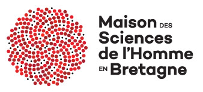

# JokeR

  

 [Home](index) | [Tasks](https://www.joker-project.com/clef-2023/tasks) | [Project](project) | Publications | [Partners](partners) | [Contest](contest) | [Contact Us](contact) | [Tools](tools) | [CLEF-2023](../../clef-2023)
 

<h2 align="center">Publications related to the JOKER project</h2>
  
  - Ermakova Liana, Miller Tristan, Regattin Fabio, Bosser Anne-Gwen, Borg Claudine, Mathurin Elise, Le Corre Gaëlle, Araujo Silvia, Hannachi Radia, Boccou Julien, Digue Albin, Demoy Aurianne et Jeanjean Benoît, «&nbsp;Overview of JOKER@CLEF 2022: Automatic Wordplay and Humour Translation Workshop&nbsp;», <em>Experimental IR Meets Multilingualityn Multimodality and Interaction</em>, Springer International Publishing, 2022. [URL](https://link.springer.com/chapter/10.1007/978-3-031-13643-6_27) - <a href="../BibTex/joker-clef-2022.bib">BibTeX</a>
  
  - Ermakova Liana, Regattin Fabio, Miller Tristan, Bosser Anne-Gwenn, Araújo Silvia, Borg Claudine, Le Corre Gaëlle, Boccou Julien, Digue Albin, Damoy Aurianne, Campen Paul et Puchalski Orlane, «&nbsp;Overview of the CLEF 2022 JOKER Task 1: Classify and Explain Instances of Wordplay&nbsp;», <em>Proceedings of the Working Notes of CLEF 2022: Conference and Labs of the Evaluation Forum</em>, CEUR Workshop Proceedings, 2022. [URL](http://ceur-ws.org/Vol-3180/paper-126.pdf) - <a href="../BibTex/overview-clef-2022-task-1.bib">BibTeX</a>
  
  - Ermakova Liana, Miller Tristan, Boccou Julien, Digue Albin, Damoy Aurianne et Campen Paul, «&nbsp;Overview of the CLEF 2022 JOKER Task 2: Translate Wordplay in Named Entities&nbsp;», <em>Proceedings of the Working Notes of CLEF 2022: Conference and Labs of the Evaluation Forum</em>, CEUR Workshop Proceedings, 2022. [URL](http://ceur-ws.org/Vol-3180/paper-127.pdf)
  
  - Ermakova Liana, Regattin Fabio, Miller Tristan, Bosser Anne-Gwenn, Borg Claudine, Jeanjean Benoît, Mathurin Élise, Le Corre Gaëlle, Hannachi Radia, Araújo Silvia, Boccou Julien, Digue Albin et Damoy Aurianne, «&nbsp;Overview of the CLEF 2022 JOKER Task 3: Pun Translation from English into French&nbsp;», <em>Proceedings of the Working Notes of CLEF 2022: Conference and Labs of the Evaluation Forum</em>, CEUR Workshop Proceedings, 2022. [URL](http://ceur-ws.org/Vol-3180/paper-128.pdf) - <a href="../BibTex/overview-clef-2022-task-3.bib">BibTeX</a>
  
  - Arroubat Hakima, «&nbsp;Wordplay location and interpretation with deep learning methods&nbsp;», <em>Proceedings of the Working Notes of CLEF 2022: Conference and Labs of the Evaluation Forum</em>, CEUR Workshop Proceedings, 2022. [URL](http://ceur-ws.org/Vol-3180/paper-129.pdf)
  
  - Boccou Julien, «&nbsp;Using a ‘punning schemes’ as a template for translating wordplay&nbsp;», <em>Proceedings of the Working Notes of CLEF 2022: Conference and Labs of the Evaluation Forum</em>, CEUR Workshop Proceedings, 2022. [URL](http://ceur-ws.org/Vol-3180/paper-130.pdf) - <a href="../BibTex/using-a-punning-scheme-as-a-template.bib">BibTeX</a>
  
  - Bosser Anne-Gwenn, Ermakova Liana, Dupin de Saint-Cyr Florence, De Loor Pierre, Charpennay Victor, Pépin-Hermann Nicolas, Alcaraz Benoit, Autran Jean-Victor, Devillers Alexandre, Grosset Juliette, Hénard Aymeric et Marchal-Bornert Florian, «&nbsp;Poetic or Humorous Text Generation: Jam event at PFIA2022&nbsp;», <em>Proceedings of the Working Notes of CLEF 2022: Conference and Labs of the Evaluation Forum</em>, CEUR Workshop Proceedings, 2022. [URL](http://ceur-ws.org/Vol-3180/paper-131.pdf)
  
  - Campen Paul et Digue Albin, «&nbsp;A history of classification and JokeR's reach&nbsp;», <em>Proceedings of the Working Notes of CLEF 2022: Conference and Labs of the Evaluation Forum</em>, CEUR Workshop Proceedings, 2022. [URL](http://ceur-ws.org/Vol-3180/paper-132.pdf) - <a href="../BibTex/a-history-of-classification.bib">BibTeX</a>
  
  - Damoy Aurianne, «&nbsp;Translation strategies: adaptation and equivalence — Joker contest&nbsp;», <em>Proceedings of the Working Notes of CLEF 2022: Conference and Labs of the Evaluation Forum</em>, CEUR Workshop Proceedings, 2022. [URL](http://ceur-ws.org/Vol-3180/paper-133.pdf) - <a href="../BibTex/translation-strategies-adaptation-and-equivalence.bib">BibTeX</a>
  
  - Daniel Charlotte et Vandenborre Noémie, «&nbsp;Translating, transcribing, transmitting and transcending a pun: why playing with words is far from being punless/pointless&nbsp;», <em>Proceedings of the Working Notes of CLEF 2022: Conference and Labs of the Evaluation Forum</em>, CEUR Workshop Proceedings, 2022. [URL](http://ceur-ws.org/Vol-3180/paper-134.pdf) - <a href="../BibTex/translating-transcribing-transmitting-transcending.bib">BibTeX</a>
  
  - Delarche Michel, «&nbsp;A translation-oriented categorisation of wordplays&nbsp;», <em>Proceedings of the Working Notes of CLEF 2022: Conference and Labs of the Evaluation Forum</em>, CEUR Workshop Proceedings, 2022. [URL](http://ceur-ws.org/Vol-3180/paper-135.pdf) - <a href="../BibTex/translation-oriented-categorisation-of-wordplays.bib">BibTeX</a>
  
  - Dhanani Farhan Rafi, Muhammad et Tahir Muhammad Atif, «&nbsp;FAST-MT Participation for the JOKER CLEF-2022 Automatic Pun and Humour Translation Tasks&nbsp;», <em>Proceedings of the Working Notes of CLEF 2022: Conference and Labs of the Evaluation Forum</em>, CEUR Workshop Proceedings, 2022. [URL](http://ceur-ws.org/Vol-3180/paper-136.pdf) - <a href="../BibTex/fast-mt-clef-2022.bib">BibTeX</a>
  
  - Digue Albin et Campen Paul, «&nbsp;Automatic translation of wordplay&nbsp;», <em>Proceedings of the Working Notes of CLEF 2022: Conference and Labs of the Evaluation Forum</em>, CEUR Workshop Proceedings, 2022. [URL](http://ceur-ws.org/Vol-3180/paper-137.pdf)
  
  - Epimakhova Aygyul, «&nbsp;Using machine learning to classify and interpret wordplay&nbsp;», <em>Proceedings of the Working Notes of CLEF 2022: Conference and Labs of the Evaluation Forum</em>, CEUR Workshop Proceedings, 2022. [URL](http://ceur-ws.org/Vol-3180/paper-138.pdf) - <a href="../BibTex/using-machine-learning.bib">BibTeX</a>
  
  - Glemarec Loïc, Bosser Anne-Gwenn, Boccou Julien et Ermakova Liana, «&nbsp;Humorous Wordplay Generation in French&nbsp;», <em>Proceedings of the Working Notes of CLEF 2022: Conference and Labs of the Evaluation Forum</em>, CEUR Workshop Proceedings, 2022. [URL](http://ceur-ws.org/Vol-3180/paper-139.pdf)
  
  - Glemarec Loïc, «&nbsp;Use of SimpleT5 for the CLEF workshop JokeR: Automatic Pun and Humor Translation&nbsp;», <em>Proceedings of the Working Notes of CLEF 2022: Conference and Labs of the Evaluation Forum</em>, CEUR Workshop Proceedings, 2022. [URL](http://ceur-ws.org/Vol-3180/paper-140.pdf) - <a href="../BibTex/use-of-simplet5-for-clef-workshop.bib">BibTeX</a>
  
  - Gutiérrez Galeano Leopoldo Jesús, «&nbsp;LJGG @ CLEF JOKER Task 3: An improved solution joining with dataset from task 1&nbsp;», <em>Proceedings of the Working Notes of CLEF 2022: Conference and Labs of the Evaluation Forum</em>, CEUR Workshop Proceedings, 2022. [URL](http://ceur-ws.org/Vol-3180/paper-141.pdf) - <a href="../BibTex/ljgg-clef-joker-task-3.bib">BibTeX</a>
  
  - Palma Preciado Victor Manuel, Sidorov Grigori et Palma Preciado Carolina, «&nbsp;Assessing Wordplay-Pun classification from JOKER dataset with pretrained BERT humorous models&nbsp;», <em>Proceedings of the Working Notes of CLEF 2022: Conference and Labs of the Evaluation Forum</em>, CEUR Workshop Proceedings, 2022. [URL](http://ceur-ws.org/Vol-3180/paper-142.pdf)
  
  - Ermakova, L., Miller, T., Puchalski, O., Regattin, F., Mathurin, É., Araújo, S., Bosser, A.-G., Borg, C., Bokiniec, M., Corre, G. L., Jeanjean, B., Hannachi, R.,Mallia, Ġ., Matas, G., & Saki, M. (2022). «&nbsp;CLEF Workshop JOKER: Automatic Wordplay and Humour Translation.&nbsp;». In M. Hagen, S. Verberne, C. Macdonald, C. Seifert, K. Balog, K. Nørvåg, & V. Setty (Eds.), Advances in Information Retrieval (Vol. 13186, pp. 355–363). Springer International Publishing. [URL](https://doi.org/10.1007/978-3-030-99739-7_45) - [BibTeX](./BibTex/joker_ecir_2022.bib)
  
  - Regattin Fabio, «&nbsp;Automatic Translation and Wordplay: An Amateur’s (Playful) Thoughts&nbsp;», <em>Proceedings of the Working Notes of CLEF 2022: Conference and Labs of the Evaluation Forum</em>, CEUR Workshop Proceedings, 2022. [URL](http://ceur-ws.org/Vol-3180/paper-143.pdf) - <a href="../BibTex/automatic-translation-of-wordplay-an-amateur-playful-thoughts.bib">BibTeX</a>
  
  - Samofalova Yuliya, Catellani Andrea et Cougnon Louise-Amélie, «&nbsp;Greenpeace Memes for Communicating Climate Change&nbsp;», <em>Proceedings of the Working Notes of CLEF 2022: Conference and Labs of the Evaluation Forum</em>, CEUR Workshop Proceedings, 2022. [URL](http://ceur-ws.org/Vol-3180/paper-144.pdf) - <a href="../BibTex/greenpeace-memes.bib">BibTeX</a>
  
  - Talec-Bernard Léa, «&nbsp;How good can an automatic translation of Pokémon names be?&nbsp;», <em>Proceedings of the Working Notes of CLEF 2022: Conference and Labs of the Evaluation Forum</em>, CEUR Workshop Proceedings, 2022 [URL](http://ceur-ws.org/Vol-3180/paper-145.pdf) - <a href="../BibTex/automatic-translation-of-pokemon-names.bib">BibTeX</a>
  
  - Hempelmann Christian F. et Miller Tristan, «&nbsp;Puns: Taxonomy and phonology&nbsp;», <em>The Routledge handbook of language and humor</em>, édité par Salvatore Attardo, Routledge, 2017, <a href="https://dx.doi.org/10.4324/9781315731162-8">URL</a> - <a href="../BibTex/Puns_Taxonomy_and_phonology.bib">BibTeX</a>
  
  - Guibon Gaël et al., <em>Multilingual Fake News Detection with Satire</em>, 2019, <a href="https://halshs.archives-ouvertes.fr/halshs-02391141/document">URL</a> - <a href="../BibTex/Multilingual_Fake_News_Detection.bib">BibTeX</a>
 
  - Kolb Waltraud et Miller Tristan, «&nbsp;Human–Computer Interaction in Pun Translation&nbsp;», <em>Using Technologies for Creative-Text Translation</em>, édité par James Hadley et al., Routledge, 2022. (à paraitre) - <a href="../BibTex/Human–Computer_Interaction_in_Pun_Translation.bib">BibTeX</a>
  
  - Miller Tristan et al., «&nbsp;Predicting the Humorousness of Tweets Using Gaussian Process Preference Learning&nbsp;», <em>Procesamiento Del Lenguaje Natural</em>, 2020, p. 37‑44. <em>DOI.org (CSL JSON)</em>, <a href="https://doi.org/10.26342/2020-64-4">URL</a> - <a href="../BibTex/Predicting_the_humorousness_of_tweets.bib">BibTeX</a>
  
  -  Miller Tristan et Gurevych Iryna, «&nbsp;Automatic disambiguation of English puns&nbsp;» in <em>Proceedings of the 53rd Annual Meeting of the Association for Computational Linguistics and the 7th International Joint Conference on Natural Language Processing (ACL–IJCNLP 2015)</em>, volume 1, pp. 719–729, <a href="https://dx.doi.org/10.3115/v1/P15-1070">URL</a> - <a href="../BibTex/Automatic_disambiguation_of_English_puns.bib">BibTeX</a> 
 
  - Miller Tristan, Hempelmann Christian F. et Gurevych Iryna, «&nbsp;SemEval-2017 Task 7: Detection and interpretation of English puns&nbsp;», in <em>Proceedings of the 11th International Workshop on Semantic Evaluation (SemEval-2017)</em>, p. 58–68, août 2017, <a href="https://dx.doi.org/10.18653/v1/S17-2005">URL</a> - <a href="../BibTex/Puns_Taxonomy_and_phonology.bib">BibTeX</a>

  - Miller Tristan, «&nbsp;The punster’s amanuensis: The proper place of humans and machines in the translation of wordplay&nbsp;», <em>Proceedings of the Second Workshop on Human-Informed Translation and Interpreting Technology (HiT-IT 2019)</em>, septembre 2019, p. 57‑74, <a href="https://doi.org/10.26615">URL</a> - <a href="../BibTex/The_punster's_amanuensis.bib">BibTeX</a>
    
  - Regattin Fabio, <em>Traduction automatique et jeux de mots : l’incursion (ludique) d’un inculte</em>. 2021, <a href="https://motsmachines.github.io/2021/en/submissions/Mots-Machines-2021_paper_5.pdf">URL</a> - <a href="../BibTex/Traduction_automatique_et_jeux_de_mots.bib">BibTeX</a>
 
  - Regattin Fabio, «&nbsp;La traduction des jeux de mots : une approche intégrée&nbsp;», <em>Atelier de traduction</em>, no 23, 2015, p. 129‑51. - <a href="../BibTex/La_traductio_ des_jeux_de_mots_ une_approche_intégrée.bib">BibTeX</a>

  - Regattin Fabio, «&nbsp;Fumetto, intertestualità, giochi di parole… le solite cose (e un giochino per chi legge). Deux Merlins di Joann Sfar: riflessioni sparse&nbsp;»,  <em>Tradurre. Pratiche Teorie Strumenti</em>, no 17, autunno 2019, <a href="https://rivistatradurre.it/2019/11/fumetto-intertestualita-giochi-di-parole-le-solite-cose-e-un-giochino-per-chi-legge/">URL</a> - <a href="../BibTex/Fumetto_intertestualita_giochi_di_parole.bib">BibTeX</a>

  - Regattin Fabio, «&nbsp;Il "langage-univers" di Boris Vian in due traduzioni italiane: Schiuma di giorni, La schiuma dei giorni&nbsp;», in <em>Tradurre figure/Translating Figurative Language</em>, Bologna, Bononia University Press, 2014, p. 193‑202. - <a href="../BibTex/Il_‘langage-univers’_di_Boris_Vian.bib">BibTeX</a>

  - Regattin Fabio, «&nbsp;Ambiguïté linguistique et pertinence&nbsp;», in Raccanello Manuela (dir.) <em>In forma di saggi. Studi di francesistica in onore di Graziano Benelli</em>, Firenze, Le Lettere, 2014, p. 229‑42. - <a href="../BibTex/Ambiguite_linguistique_et_pertinence.bib">BibTeX</a>

  - Regattin Fabio, «&nbsp;Quand "la traduction est un jeu": métaphores ludiques dans le discours contemporain sur la traduction&nbsp;», <em>TTR (Traduction, Terminologie, Rédaction)</em>, vol. 26, no 1, 2013, p. 221‑54. - <a href="../BibTex/Quand_la_traduction_est_un_jeu.bib">BibTeX</a>

  - Regattin Fabio, «&nbsp;Rejouer le jeu&nbsp;», <em>L’Étoile de mer</em>, no numéro spécial n. 2, 2010, p. 63‑74. - <a href="../BibTex/Rejouer_le_jeu.bib">BibTeX</a>

  - Regattin Fabio, <em>Le Jeu des mots Réflexions sur la traduction des jeux linguistiques</em>, Bologne, Emil, 2009. - <a href="../BibTex/Le_Jeu_des_mots_Reflexions.bib">BibTeX</a>

  - Regattin Fabio, «&nbsp;La traduction des jeux de mots: question de langue, question de traducteur?&nbsp;» <em>Actes du 10e colloque estudiantin de la SESDEF</em>, 2008, <a href="http://www.chass.utoronto.ca/french/SESDEF/miroir/regattin.pdf">URL</a>. - <a href="../BibTex/La traduction des jeux de mots question de langue.bib">BibTeX</a>

  - Regattin Fabio (trad.) ,Verhasselt Étienne, «&nbsp;La Bimbia&nbsp;», <em>Les Pas perdus</em>, Le Tripode, p. 57‑59, <a href="https://www.intralinea.org/index.php/translations/item/2412">URL</a>. - <a href="../BibTex/La_Bimbia.bib">BibTeX</a>
 
  - Pano Alamán Ana et Fabio Regattin (dir.), <em>Giochi di parole e traduzione nelle lingue europee</em>, Roma, Aracne , 2018. - <a href="../BibTex/Giochi_di_parole_e_traduzione.bib">BibTeX</a>

  - Uma Alexandra et al.,  «&nbsp;SemEval-2021 Task 12: Learning with Disagreements&nbsp;», <em>Proceedings of the 15th International Workshop on Semantic Evaluation (SemEval-2021)</em>, Association for Computational Linguistics, 2021, p. 338‑47. <em>DOI.org (Crossref)</em>, <a href="https://doi.org/10.18653/v1/2021.semeval-1.41">URL</a>. - <a href="../BibTex/SemEval-2021_Task_12.bib">BibTeX</a>

<em>This project has received a government grant managed by the National Research Agency under the program "Investissements d'avenir" integrated into France 2030, with the Reference ANR-19-GURE-0001.</em>

<em>JokeR is supported by The Human Science Institute in Brittany (MSHB)</em>

  
  
  

 

   

